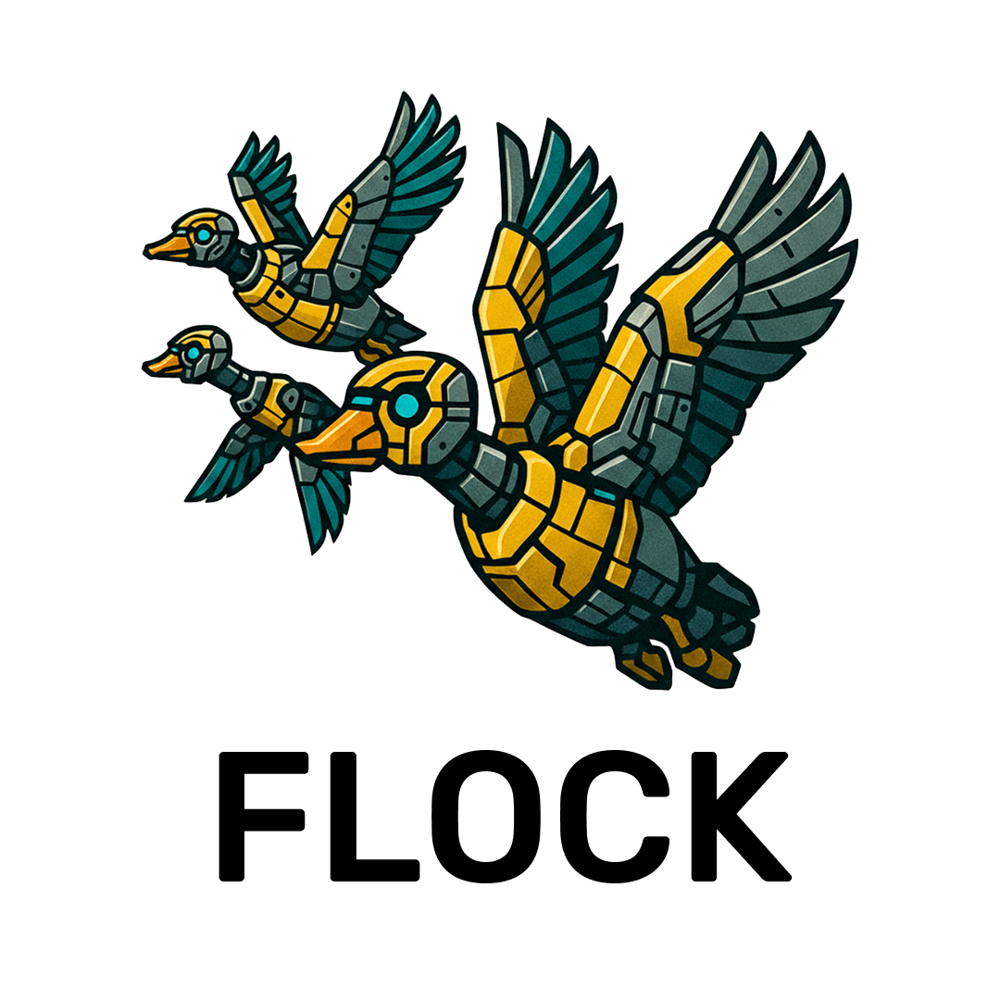

<a id="readme-top"></a>

<br />

<div align="center">
  <a href="https://dais-polymtl.github.io/flock/">
    
  </a>
  <br /><br />
  <p align="center">
    DBMS extension for multimodal query processing and optimization.
    <br />
    <a href="https://dais-polymtl.github.io/flock/docs/what-is-flock"><strong>Explore the docs »</strong></a>
    <br />
    <br />
    <a href="https://dais-polymtl.github.io/flock/">Landing Page</a>
    |
    <a href="https://github.com/dais-polymtl/flock/issues/new?labels=bug&template=bug-report.md">Report Bug</a>
    |
    <a href="https://github.com/dais-polymtl/flock/issues/new?labels=enhancement&template=feature-request.md">Request Feature</a>
  </p>
</div>

<details>
  <summary>
    <h2>Table of Contents</h2>
  </summary>
  <ol>
    <li><a href="#-about-the-project">About The Project</a></li>
    <li><a href="#-features">Features</a></li>
    <li>
      <a href="#-getting-started">Getting Started</a>
      <ul>
        <li><a href="#-prerequisites">Prerequisites</a></li>
        <li><a href="#⚙-installation">Installation</a></li>
      </ul>
    </li>
    <li><a href="#-usage">Usage</a></li>
    <li><a href="#-roadmap">Roadmap</a></li>
    <li><a href="#-feedback-and-issues">Feedback and Issues</a></li>
    <li><a href="#-license">License</a></li>
    <li><a href="#-acknowledgments">Acknowledgments</a></li>
  </ol>
</details>

## 📜 About The Project

Flock is an advanced **DuckDB** extension that seamlessly integrates analytics with semantic analysis through declarative SQL queries. Designed for modern data analysis needs, Flock empowers users to work with structured and unstructured data, combining OLAP workflows with the capabilities of **LLMs** (Large Language Models) and **RAG** (Retrieval-Augmented Generation) pipelines.

To cite the project:
```
@article{10.14778/3750601.3750685,
  author  = {Dorbani, Anas and Yasser, Sunny and Lin, Jimmy and Mhedhbi, Amine},
  title   = {Beyond Quacking: Deep Integration of Language Models and RAG into DuckDB},
  journal = {Proc. VLDB Endow.},
  year    = {2025},
  volume  = {18},
  number  = {12},
  doi     = {10.14778/3750601.3750685},
  url     = {https://doi.org/10.14778/3750601.3750685}
}
```

<p align="right"><a href="#readme-top">🔝 back to top</a></p>

## 🔥 Features

- **Declarative SQL Interface**: Perform text generation, classification, summarization, filtering, and embedding generation using SQL queries.
- **Multi-Provider Support**: Easily integrate with OpenAI, Azure, and Ollama for your AI needs.
- **End-to-End RAG Pipelines**: Enable retrieval and augmentation workflows for enhanced analytics.
- **Map and Reduce Functions**: Intuitive APIs for combining semantic tasks and data analytics directly in DuckDB.

<p align="right"><a href="#readme-top">🔝 back to top</a></p>

## 🚀 Getting Started

### 📝 Prerequisites

1. **DuckDB**: Version 1.1.1 or later. Install it from the official [DuckDB installation guide](https://duckdb.org/docs/installation/).
2. **Supported Providers**: Ensure you have credentials or API keys for at least one of the supported providers:
   - OpenAI
   - Azure
   - Ollama
3. **Supported OS**:
   - Linux
   - macOS
   - Windows

<p align="right"><a href="#readme-top">🔝 back to top</a></p>

### ⚙️ Installation

Flock can be installed in two ways:

#### Option 1: Install from Community Extension (Recommended)

Flock is a **Community Extension** available directly from DuckDB's community catalog.

1. Install the extension:
   ```sql
   INSTALL flock FROM community;
   ```
2. Load the extension:
   ```sql
   LOAD flock;
   ```

#### Option 2: Build from Source

If you want to build Flock from source or contribute to the project, you can use our automated build script:

1. Clone the repository with submodules:
   ```bash
   git clone --recursive https://github.com/dais-polymtl/flock.git
   cd flock
   ```
   
   Or if you've already cloned without submodules:
   ```bash
   git submodule update --init --recursive
   ```

2. Run the build and run script:
   ```bash
   ./scripts/build_and_run.sh
   ```

   This interactive script will guide you through:
   - Checking prerequisites (CMake, build tools, compilers)
   - Setting up vcpkg (dependency manager)
   - Building the project (Debug or Release)
   - Running DuckDB with the Flock extension

   The script will automatically detect your system configuration and use the appropriate build tools (Ninja or Make).

3. The script will launch DuckDB with Flock extension ready to use. Make sure to check the [documentation](https://dais-polymtl.github.io/flock/docs/what-is-flock) for usage examples.

**Requirements for building from source:**
- CMake (3.5 or later)
- C++ compiler (GCC, Clang, or MSVC)
- Build system (Ninja or Make)
- Git
- Python 3 (optional, for integration tests)

<p align="right"><a href="#readme-top">🔝 back to top</a></p>

## 💻 Usage

### 🔧 Example Query

Using Flock, you can run semantic analysis tasks directly in DuckDB. For example:

```sql
SELECT llm_complete(
            { 'model_name': 'summarizer'},
            { 'prompt_name': 'description-generation', 'context_columns': [{ 'data': product_name }]}
       ) AS product_description
  FROM UNNEST(['Wireless Headphones', 'Gaming Laptop', 'Smart Watch']) AS t(product_name);
```

Explore more usage examples in the [documentation](https://dais-polymtl.github.io/flock/docs/what-is-flock).

<p align="right"><a href="#readme-top">🔝 back to top</a></p>

## 🛣️ Roadmap

Our roadmap outlines upcoming features and improvements. Stay updated by checking out our [detailed plan](https://github.com/dais-polymtl/flock/issues/39).

<p align="right"><a href="#readme-top">🔝 back to top</a></p>

## 🛠️ Feedback and Issues

We value your feedback! If you’d like to report an issue or suggest a new feature, please use the links below:

- <a href="https://github.com/dais-polymtl/flock/issues/new?labels=bug&template=bug-report.md">Report a Bug</a>
- <a href="https://github.com/dais-polymtl/flock/issues/new?labels=enhancement&template=feature-request.md">Request a Feature</a>

For contributing code or other contributions, please refer to our dedicated [Contribution Guidelines](#).

<p align="right"><a href="#readme-top">🔝 back to top</a></p>

## 📝 License

This project is licensed under the MIT License. See the [LICENSE](LICENSE) file for details.

<p align="right"><a href="#readme-top">🔝 back to top</a></p>

## ✨ Team

This project is under active development by the [**Data & AI Systems Laboratory (DAIS Lab)**](https://github.com/dais-polymtl) at [**Polytechnique Montréal**](https://www.polymtl.ca/).

<p align="right"><a href="#readme-top">🔝 back to top</a></p>